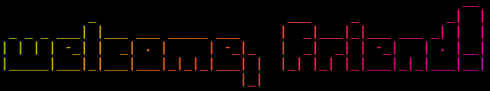

I'm Erwann Lagouche, a student in DevOps, soon to integrate the 42 school.

<div align="center" width="100%">
<table>
<tr>
<td width="100%">

#### 💫 Recent activity

<!--START_SECTION:activity-->

1. 🎉 Merged PR [#14](https://github.com/airone01/dotfiles2/pull/14) in [airone01/dotfiles2](https://github.com/airone01/dotfiles2)
2. 💪 Opened PR [#14](https://github.com/airone01/dotfiles2/pull/14) in [airone01/dotfiles2](https://github.com/airone01/dotfiles2)
3. 🔒 Closed issue [#12](https://github.com/airone01/dotfiles2/issues/12) in [airone01/dotfiles2](https://github.com/airone01/dotfiles2)
4. 🎉 Merged PR [#13](https://github.com/airone01/dotfiles2/pull/13) in [airone01/dotfiles2](https://github.com/airone01/dotfiles2)
5. 💪 Opened PR [#13](https://github.com/airone01/dotfiles2/pull/13) in [airone01/dotfiles2](https://github.com/airone01/dotfiles2)
<!--END_SECTION:activity-->

#### 🌃 WakaTime

<!--START_SECTION:waka-->


**🐱 My GitHub Data**

> 📦 303.0 kB Used in GitHub's Storage
>
> 🏆 309 Contributions in the Year 2024
>
> 🚫 Not Opted to Hire
>
> 📜 53 Public Repositories
>
> 🔑 47 Private Repositories
>
> **I'm an Early 🐤**

```text
🌞 Morning                715 commits         █████░░░░░░░░░░░░░░░░░░░░   21.34 %
🌆 Daytime                1553 commits        ████████████░░░░░░░░░░░░░   46.36 %
🌃 Evening                751 commits         ██████░░░░░░░░░░░░░░░░░░░   22.42 %
🌙 Night                  331 commits         ██░░░░░░░░░░░░░░░░░░░░░░░   09.88 %
```

📊 **This Week I Spent My Time On**

```text
🕑︎ Time Zone: Europe/Paris

💬 Programming Languages:
Other                    1 hr 39 mins        ██████████████████████░░░   89.42 %
Rust                     5 mins              █░░░░░░░░░░░░░░░░░░░░░░░░   04.99 %
Bash                     4 mins              █░░░░░░░░░░░░░░░░░░░░░░░░   03.69 %
TOML                     2 mins              ░░░░░░░░░░░░░░░░░░░░░░░░░   01.90 %

🐱‍💻 Projects:
Terminal                 1 hr 29 mins        ████████████████████░░░░░   80.61 %
multidl                  21 mins             █████░░░░░░░░░░░░░░░░░░░░   19.39 %
```

Last Updated on 16/08/2024 13:32:51 UTC

<!--END_SECTION:waka-->

</td>
</tr>
</table>
</div>


